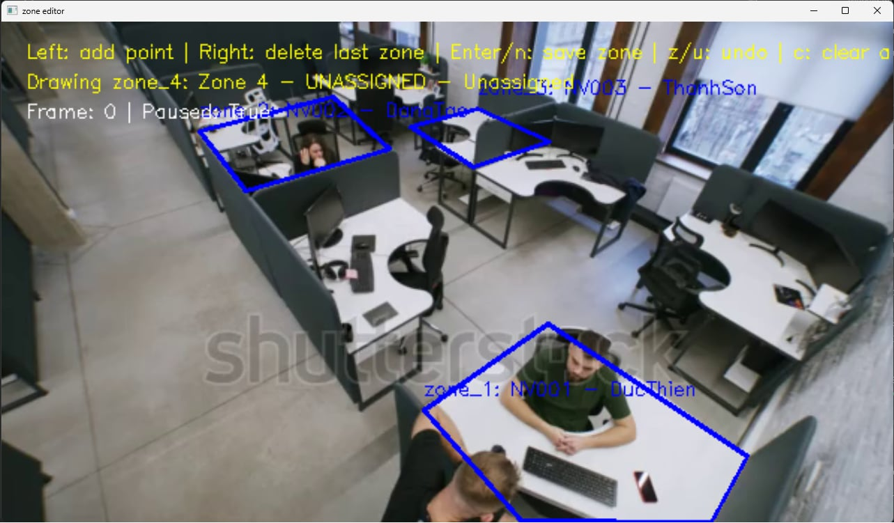

# Factory Employee Tracking YOLOv8

Ứng dụng demo giám sát nhân sự trong khu vực làm việc bằng camera/video, sử dụng **YOLOv8**, **ByteTrack** và **OpenVINO**. Dự án tập trung vào bài toán phát hiện người, tracking theo vùng làm việc, gán nhân sự theo khu vực phụ trách, ghi nhận trạng thái rời vị trí/quay lại và hỗ trợ pipeline thu thập dữ liệu để train lại YOLO bằng Roboflow + Google Colab.

---

## Mục Tiêu Dự Án

Dự án được xây dựng cho bối cảnh giám sát nhân sự trong xưởng/nhà máy, nơi camera thường đặt xa, góc nhìn rộng và khó nhận diện khuôn mặt. Thay vì định danh từng người bằng face recognition, hệ thống sử dụng cách tiếp cận **zone-based identity assignment**:

```text
Mỗi khu vực làm việc cố định ↔ một nhân sự phụ trách
Người được tracking đi vào khu vực đó đủ lâu ↔ gán track_id với nhân sự của khu vực
```

Cách tiếp cận này phù hợp khi mỗi nhân sự thường làm việc tại một vị trí/máy/khu vực nhất định trong xưởng.

---

## Demo Video

Video demo được commit trực tiếp trong repo để người xem có thể mở ngay trên GitHub.

### Before Tracking

Video gốc trước khi chạy hệ thống tracking:

<video src="https://github.com/user-attachments/assets/01ab951c-943c-45f9-8c3e-7ee4dc07c1ab" controls width="100%"></video>

### Zone Editor

Công cụ vẽ khu vực làm việc trực tiếp trên video:



### After Tracking

Chạy tracking và lưu video kết quả ra file:

```powershell
python yolo_tracking.py --video demo.mp4 --model best_openvino_model --output-video demo_after_tracking.mp4
```

Nếu chỉ muốn render video, không mở cửa sổ OpenCV:

```powershell
python yolo_tracking.py --video demo.mp4 --model best_openvino_model --output-video demo_after_tracking.mp4 --no-display
```

Video kết quả:

<video src="https://github.com/user-attachments/assets/4a683e40-a188-4d45-89ae-d763149aaf9b" controls width="100%"></video>

---

## Tính Năng Chính

- Phát hiện người bằng YOLOv8.
- Tracking ID bằng Ultralytics tracker/ByteTrack.
- Hỗ trợ model PyTorch `.pt` và model đã export sang OpenVINO.
- Vẽ vùng làm việc bằng công cụ OpenCV `zone_editor.py`.
- Lưu và load vùng làm việc từ `work_zones.json`.
- Gán mỗi vùng làm việc với một nhân sự/khu vực cụ thể.
- Gán tên nhân sự dựa trên vùng làm việc thay vì nhận diện khuôn mặt.
- Theo dõi trạng thái `OUT`, `ENTERING`, `WORK`, `AWAY`, `RETURNING`, `RETURNED`.
- Ghi log sự kiện rời vị trí và quay lại vào `history.csv`.
- Lưu video tracking đã vẽ bounding box, zone và trạng thái ra file `.mp4`.
- Hỗ trợ cắt frame từ video để tạo dữ liệu train YOLO.
- Hỗ trợ pipeline train YOLO custom dataset bằng Roboflow + Google Colab.
- Hỗ trợ export model YOLO sang OpenVINO để tối ưu inference local trên CPU.

---

## Công Nghệ Sử Dụng

- Python 3.10+
- OpenCV
- NumPy
- Ultralytics YOLOv8
- ByteTrack
- OpenVINO
- Roboflow
- Google Colab

---

## Cấu Trúc Dự Án

```text
factory-employee-tracking-yolo8v/
├── config.py                 # Cấu hình model, video, threshold, thời gian trạng thái
├── yolo_tracking.py          # Entry point tracking nhân sự theo vùng làm việc
├── zone_editor.py            # Công cụ vẽ vùng làm việc trên video
├── zone_loader.py            # Load và validate work_zones.json
├── work_zones.json           # Vùng làm việc đã vẽ bằng zone_editor.py
├── work_zones.py             # Vùng mẫu dạng Python dict
├── extract_frame.py          # Cắt frame từ video để tạo dữ liệu train
├── export_openvino.py        # Export YOLO .pt sang OpenVINO
├── demo.mp4                  # Video demo gốc
├── demo_after_tracking.mp4   # Video kết quả sau tracking
├── zone_editor.jpg           # Ảnh minh họa công cụ vẽ vùng
├── requirements.txt
├── README.md
└── LICENSE
```

---

## File Không Commit

Repo bỏ qua các file runtime hoặc file nặng không cần thiết:

```text
venv/
__pycache__/
history.csv
captures/
frames/
frames_from_camera/
records/
*.pt
*_openvino_model/
```

`demo.mp4` và `demo_after_tracking.mp4` không bị ignore để có thể hiển thị trực tiếp trên GitHub.

---

## Cài Đặt

### 1. Clone repo

```powershell
git clone <repo-url>
cd factory-employee-tracking-yolo8v
```

### 2. Tạo môi trường ảo

```powershell
python -m venv venv
.\venv\Scripts\activate
```

### 3. Cài dependencies

```powershell
pip install -r requirements.txt
```

### 4. Kiểm tra cài đặt

```powershell
python -m py_compile config.py work_zones.py zone_loader.py zone_editor.py yolo_tracking.py extract_frame.py export_openvino.py
```

---

## Cấu Hình

Cấu hình chính nằm trong `config.py`:

```python
yolo_model_path = BASE_DIR / "best_openvino_model"
yolo_video_path = BASE_DIR / "demo.mp4"
yolo_log_file = BASE_DIR / "history.csv"
yolo_confidence = 0.35
yolo_iou = 0.5
yolo_image_size = 640
yolo_frame_skip = 1
```

Model OpenVINO hiện được cấu hình với input size `640`. Nếu model export có input cố định, nên giữ `--imgsz 640` khi chạy tracking.

---

## Vẽ Vùng Làm Việc

Chạy công cụ vẽ vùng:

```powershell
python zone_editor.py
```

Điều khiển:

| Phím / thao tác | Chức năng |
| --- | --- |
| Left click | Thêm điểm polygon |
| Right click | Xóa zone cuối |
| Enter / n | Lưu zone hiện tại |
| z / u | Undo điểm đang vẽ |
| c | Xóa toàn bộ zone |
| r | Reset polygon đang vẽ |
| s | Lưu `work_zones.json` |
| Space / p | Pause / resume video |
| a / d | Lùi / tiến frame khi pause |
| q | Thoát |

Kết quả được lưu vào:

```text
work_zones.json
```

Ví dụ dữ liệu zone sau khi lưu:

```json
{
  "zones": [
    {
      "zone_id": "zone_1",
      "zone_name": "Khu cat go",
      "employee_code": "NV001",
      "employee_name": "Nguyen Van A",
      "points": [[80, 170], [420, 170], [430, 620], [70, 620]]
    }
  ]
}
```

---

## Chạy Tracking

### Chạy theo cấu hình mặc định

```powershell
python yolo_tracking.py
```

Mặc định chương trình lưu video đã annotate vào:

```text
demo_after_tracking.mp4
```

### Chỉ định video và model

```powershell
python yolo_tracking.py --video demo.mp4 --model best_openvino_model
```

### Chạy với model OpenVINO input size 640

```powershell
python yolo_tracking.py --video demo.mp4 --model best_openvino_model --conf 0.35 --imgsz 640 --frame-skip 1
```

### Chỉ định nơi lưu video output

```powershell
python yolo_tracking.py --video demo.mp4 --model best_openvino_model --output-video demo_after_tracking.mp4
```

### Tắt lưu video

```powershell
python yolo_tracking.py --no-save-video
```

### Render video không mở cửa sổ preview

```powershell
python yolo_tracking.py --output-video demo_after_tracking.mp4 --no-display
```

### Chỉ định tracker

```powershell
python yolo_tracking.py --tracker ".\venv\Lib\site-packages\ultralytics\cfg\trackers\bytetrack.yaml"
```

---

## Trạng Thái Tracking

| Trạng thái | Ý nghĩa |
| --- | --- |
| `OUT` | Người đang ở ngoài vùng làm việc. Track mới xuất hiện ngoài vùng chưa bị tính vi phạm. |
| `ENTERING` | Người mới đi vào vùng, đang chờ đủ thời gian xác nhận `WORK`. |
| `WORK` | Người đã ở trong vùng đủ `--work-confirm-time` giây. |
| `AWAY` | Người từng được xác nhận `WORK`, sau đó rời vùng quá `--max-out-time` giây. |
| `RETURNING` | Người đang quay lại vùng sau khi bị `AWAY`, chưa đủ thời gian xác nhận. |
| `RETURNED` | Người đã quay lại đủ `--return-confirm-time` giây, hệ thống ghi log `da_quay_lai`. |

---

## Tham Số Quan Trọng

| Tham số | Mặc định | Mô tả |
| --- | ---: | --- |
| `--conf` | `0.35` | Ngưỡng confidence phát hiện người. |
| `--iou` | `0.5` | Ngưỡng IoU cho NMS. |
| `--imgsz` | `640` | Kích thước input inference. |
| `--frame-skip` | `1` | Số frame bỏ qua giữa các lần inference. |
| `--max-out-time` | `5.0` | Số giây được phép rời vùng trước khi bị tính `AWAY`. |
| `--work-confirm-time` | `3.0` | Số giây cần ở trong vùng để được xác nhận `WORK`. |
| `--return-confirm-time` | `3.0` | Số giây cần ở lại vùng sau khi quay lại để ghi `RETURNED`. |

---

## Log Kết Quả

Tracking ghi sự kiện vào:

```text
history.csv
```

Các cột:

```text
thoi_gian,track_id,employee,employee_code,trang_thai,so_giay_vang_mat
```

Sự kiện chính:

- `roi_khoi_vi_tri`
- `da_quay_lai`

Reset log nhưng giữ header:

```powershell
Set-Content -Path history.csv -Value "thoi_gian,track_id,employee,employee_code,trang_thai,so_giay_vang_mat" -Encoding UTF8
```

---

# Train YOLO Custom Model Bằng Roboflow Và Google Colab

Phần này dùng khi muốn train lại YOLO để phù hợp hơn với góc camera, ánh sáng và bối cảnh xưởng thực tế.

Pipeline đề xuất:

```text
Video camera/xưởng
→ Cắt frame
→ Upload Roboflow
→ Label class person
→ Export dataset YOLOv8
→ Train trên Google Colab
→ Tải best.pt
→ Export OpenVINO
→ Chạy tracking local
```

---

## 1. Cắt Frame Từ Video

Dùng file `extract_frame.py` để cắt frame từ video demo hoặc video camera thật:

```powershell
python extract_frame.py
```

Gợi ý cấu hình trong file cắt frame:

```python
video_path = "demo.mp4"
save_dir = "frames"
frame_interval = 30
```

Ý nghĩa:

- `video_path`: video nguồn.
- `save_dir`: thư mục lưu ảnh.
- `frame_interval = 30`: cứ 30 frame lưu 1 ảnh.

Nếu video ít dữ liệu hoặc người di chuyển nhanh, có thể giảm:

```python
frame_interval = 15
```

Sau khi chạy, ảnh sẽ nằm trong:

```text
frames/
```

---

## 2. Label Dữ Liệu Trên Roboflow

Trên Roboflow:

1. Tạo project mới.
2. Chọn loại project: **Object Detection**.
3. Upload thư mục `frames/`.
4. Vẽ bounding box quanh người.
5. Chỉ dùng một class:

```text
person
```

Không nên tạo class theo tên nhân sự như `NV001`, `NV002`, `NguyenVanA`. Trong dự án này, YOLO chỉ dùng để phát hiện người; việc gán tên nhân sự được xử lý bằng vùng làm việc trong `work_zones.json`.

Sau khi label xong:

1. Chia dataset thành `train`, `valid`, `test`.
2. Generate version.
3. Chọn export format: **YOLOv8**.
4. Copy đoạn code download dataset do Roboflow cung cấp.

Ví dụ code Roboflow thường có dạng:

```python
!pip install roboflow

from roboflow import Roboflow
rf = Roboflow(api_key="YOUR_API_KEY")
project = rf.workspace("your-workspace").project("your-project")
version = project.version(1)
dataset = version.download("yolov8")
```

---

## 3. Train YOLO Trên Google Colab

### 3.1. Bật GPU trên Colab

Trong Google Colab:

```text
Runtime → Change runtime type → Hardware accelerator → T4 GPU → Save
```

Kiểm tra GPU:

```python
!nvidia-smi
```

### 3.2. Cài Ultralytics

```python
!pip install ultralytics -q

import ultralytics
ultralytics.checks()
```

### 3.3. Tải dataset từ Roboflow

Dán đoạn code Roboflow export YOLOv8 vào Colab, ví dụ:

```python
!pip install roboflow -q

from roboflow import Roboflow
rf = Roboflow(api_key="YOUR_API_KEY")
project = rf.workspace("your-workspace").project("your-project")
version = project.version(1)
dataset = version.download("yolov8")
```

Sau khi tải xong, xác định đường dẫn `data.yaml`, ví dụ:

```python
DATA_YAML = "/content/factory-person-1/data.yaml"
```

---

## 4. Train Model YOLOv8n

Với mục tiêu demo hoặc máy local không có GPU rời, nên bắt đầu bằng `yolov8n.pt`:

```python
from ultralytics import YOLO

DATA_YAML = "/content/factory-person-1/data.yaml"

model = YOLO("yolov8n.pt")

model.train(
    data=DATA_YAML,
    epochs=50,
    imgsz=640,
    batch=16,
    device=0,
    workers=2,
    project="/content/runs",
    name="factory_person_yolov8n"
)
```

Nếu Colab báo thiếu VRAM, giảm batch:

```python
batch=8
```

Nếu chỉ muốn train thử nhanh:

```python
epochs=20
```

Sau khi train xong, model tốt nhất nằm tại:

```text
/content/runs/factory_person_yolov8n/weights/best.pt
```

---

## 5. Validate Và Test Model

Validate model:

```python
from ultralytics import YOLO

best_model_path = "/content/runs/factory_person_yolov8n/weights/best.pt"
model = YOLO(best_model_path)

model.val(
    data=DATA_YAML,
    imgsz=640
)
```

Test trên ảnh:

```python
model.predict(
    source="/content/test_image.jpg",
    conf=0.3,
    imgsz=640,
    save=True
)
```

Test trên video:

```python
model.predict(
    source="/content/demo.mp4",
    conf=0.3,
    imgsz=640,
    save=True
)
```

Kết quả predict thường nằm trong:

```text
/content/runs/detect/predict
```

---

## 6. Tải Model `.pt` Về Máy

```python
from google.colab import files

files.download("/content/runs/factory_person_yolov8n/weights/best.pt")
```

Copy `best.pt` vào thư mục repo local.

---

## 7. Export Model Sang OpenVINO

Có hai cách export.

### Cách 1: Export trực tiếp trên Google Colab

```python
from ultralytics import YOLO

model = YOLO("/content/runs/factory_person_yolov8n/weights/best.pt")

model.export(
    format="openvino",
    imgsz=640
)
```

Nén thư mục OpenVINO để tải về:

```python
!zip -r best_openvino_model.zip /content/runs/factory_person_yolov8n/weights/best_openvino_model

from google.colab import files
files.download("best_openvino_model.zip")
```

Sau khi tải về, giải nén và đảm bảo cấu trúc thư mục đúng:

```text
best_openvino_model/
├── best.xml
├── best.bin
└── metadata.yaml
```

### Cách 2: Export tại local

Nếu đã tải `best.pt` về repo local:

```powershell
python export_openvino.py
```

Hoặc dùng Ultralytics CLI:

```powershell
yolo export model=best.pt format=openvino imgsz=640
```

Sau khi export, thư mục model mặc định là:

```text
best_openvino_model/
```

---

## 8. Dùng Model Custom Trong Tracking

Sửa `config.py`:

```python
yolo_model_path = BASE_DIR / "best_openvino_model"
yolo_image_size = 640
yolo_confidence = 0.35
```

Hoặc chạy trực tiếp bằng tham số:

```powershell
python yolo_tracking.py --video demo.mp4 --model best_openvino_model --conf 0.35 --imgsz 640
```

Nếu muốn test file `.pt` trước khi export:

```powershell
python yolo_tracking.py --video demo.mp4 --model best.pt --conf 0.35 --imgsz 640
```

---

## 9. Gợi Ý Dataset Cho Bối Cảnh Xưởng

Để model nhận diện người ổn định hơn trong xưởng, nên bổ sung ảnh ở nhiều tình huống:

- Người ở gần camera.
- Người ở xa camera.
- Người bị che bởi máy móc, bàn thao tác, sản phẩm.
- Người đứng nghiêng hoặc quay lưng.
- Nhiều người xuất hiện cùng lúc.
- Người mặc đồng phục, mũ bảo hộ, tai nghe bảo hộ.
- Ánh sáng mạnh/yếu khác nhau.
- Frame không có người hoặc có vật thể dễ gây nhầm.

Số lượng dữ liệu gợi ý:

| Mục tiêu | Số ảnh gợi ý |
| --- | ---: |
| Test pipeline | 200 - 500 ảnh |
| Demo ổn hơn | 1.000 - 3.000 ảnh |
| Dùng nghiêm túc hơn | 3.000+ ảnh |

---

## 10. Lưu Ý Khi Train

- Chỉ label class `person`.
- Không label theo tên nhân sự.
- Nên train bằng dữ liệu lấy từ chính camera thật của xưởng.
- Nếu tracking bị mất người ở xa, cần bổ sung ảnh người nhỏ/xa camera.
- Nếu detect nhầm máy móc thành người, cần bổ sung ảnh negative hoặc label kỹ hơn.
- Nếu chạy local bằng CPU, nên ưu tiên `yolov8n` hoặc `yolov8s`, sau đó export OpenVINO.
- Không nên tăng `imgsz` khi model OpenVINO đã export fixed-size `640`.

---

## Troubleshooting

### Không mở được video

- Kiểm tra `demo.mp4` có tồn tại trong thư mục repo.
- Kiểm tra `yolo_video_path` trong `config.py`.
- Thử truyền video trực tiếp qua `--video`.

### Không load được model OpenVINO

- Kiểm tra thư mục `best_openvino_model/` có tồn tại.
- Đảm bảo bên trong có các file:

```text
best.xml
best.bin
metadata.yaml
```

- Nếu thư mục bị lồng sai cấp sau khi giải nén, hãy copy `best.xml`, `best.bin`, `metadata.yaml` ra trực tiếp trong `best_openvino_model/`.
- Nếu dùng `.pt`, truyền trực tiếp file `.pt` qua `--model`.
- Đảm bảo `ultralytics` và `openvino` đã được cài đúng.

### Tracking bị mất người ở xa

- Giảm nhẹ `--conf`, ví dụ `0.25` đến `0.35`.
- Giữ `--frame-skip 1` để tracking ổn định hơn.
- Bổ sung dữ liệu train ở góc camera xa.
- Không tăng `--imgsz` nếu model OpenVINO export fixed-size `640`.

### Tracking bị loạn ở vùng xa camera

- Tăng `yolo_min_box_area` để bỏ qua bbox quá nhỏ.
- Vẽ zone chỉ ở khu vực cần giám sát.
- Không dùng người quá xa camera để quyết định trạng thái `WORK` hoặc `AWAY`.
- Bổ sung dữ liệu train người ở xa nếu vẫn muốn detect vùng xa.

### Vùng làm việc bị lệch

- Chạy lại:

```powershell
python zone_editor.py
```

- Vẽ zone trên cùng video/cùng độ phân giải với video tracking.
- Kiểm tra mapping `employee_code` / `employee_name` trong `zone_editor.py`.

### Colab không nhận GPU

- Vào `Runtime → Change runtime type`.
- Chọn `T4 GPU`.
- Chạy lại:

```python
!nvidia-smi
```

### Roboflow export sai đường dẫn `data.yaml`

Sau khi download dataset, chạy:

```python
import os

for root, dirs, files in os.walk("/content"):
    if "data.yaml" in files:
        print(os.path.join(root, "data.yaml"))
```

Copy đường dẫn in ra và gán lại:

```python
DATA_YAML = "/content/your-dataset-folder/data.yaml"
```

---

## Kiểm Tra Trước Khi Push

Compile nhanh:

```powershell
python -m py_compile config.py work_zones.py zone_loader.py zone_editor.py yolo_tracking.py extract_frame.py export_openvino.py
```

Kiểm tra trạng thái Git:

```powershell
git status --short
```

Kiểm tra file lớn trước khi commit:

```powershell
git status --short
```

---

## Roadmap

- Tách state machine tracking thành module riêng để dễ test.
- Thêm unit test cho `zone_loader.py`.
- Thêm Dockerfile hoặc script setup môi trường.
- Thêm chế độ tracking trực tiếp từ RTSP/IP camera.
- Thêm công cụ record video camera để cắt frame train YOLO.
- Thêm dashboard xem log `history.csv`.

---

## License

Xem file `LICENSE`.
